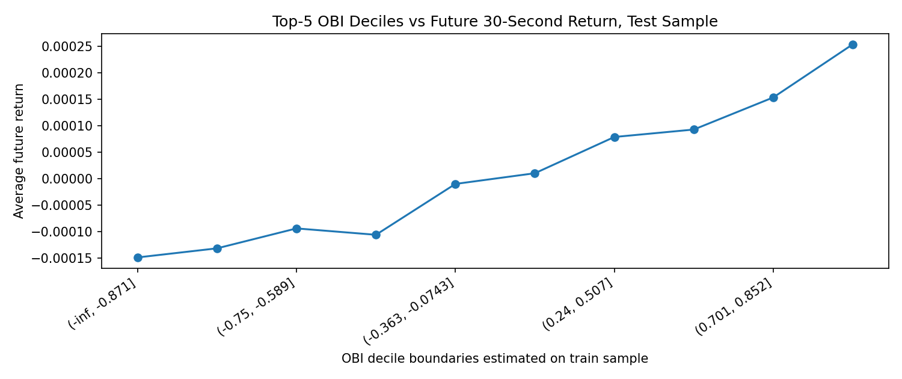
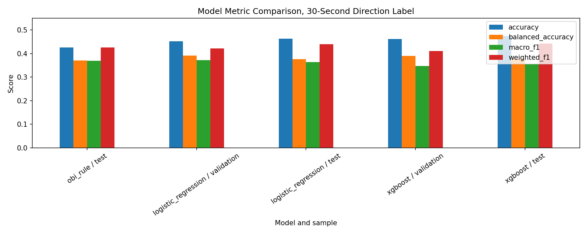
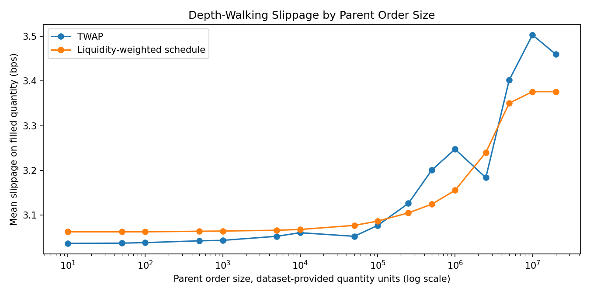
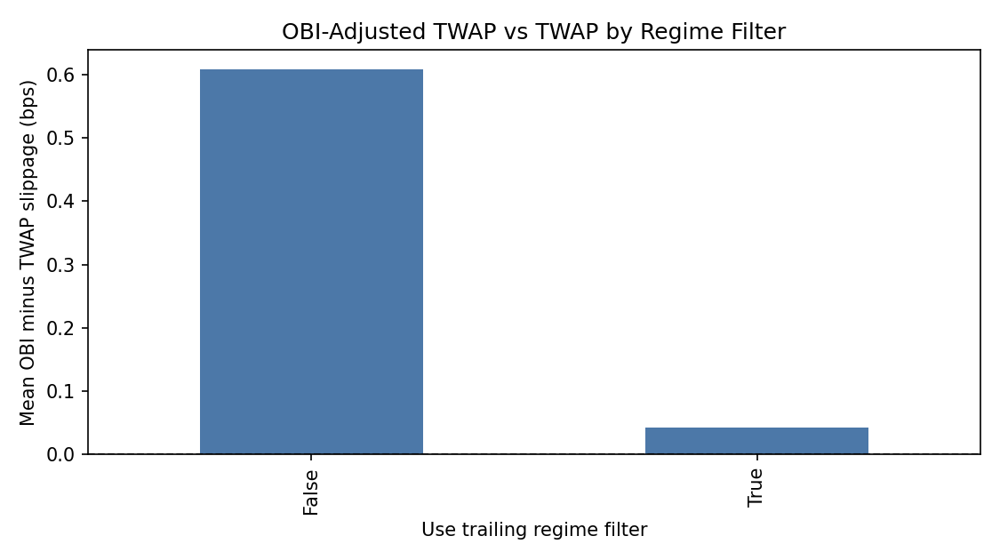
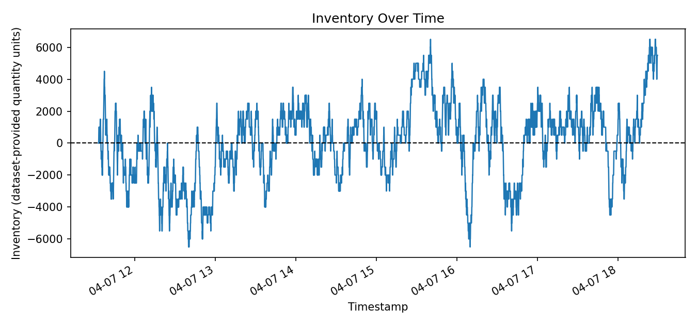
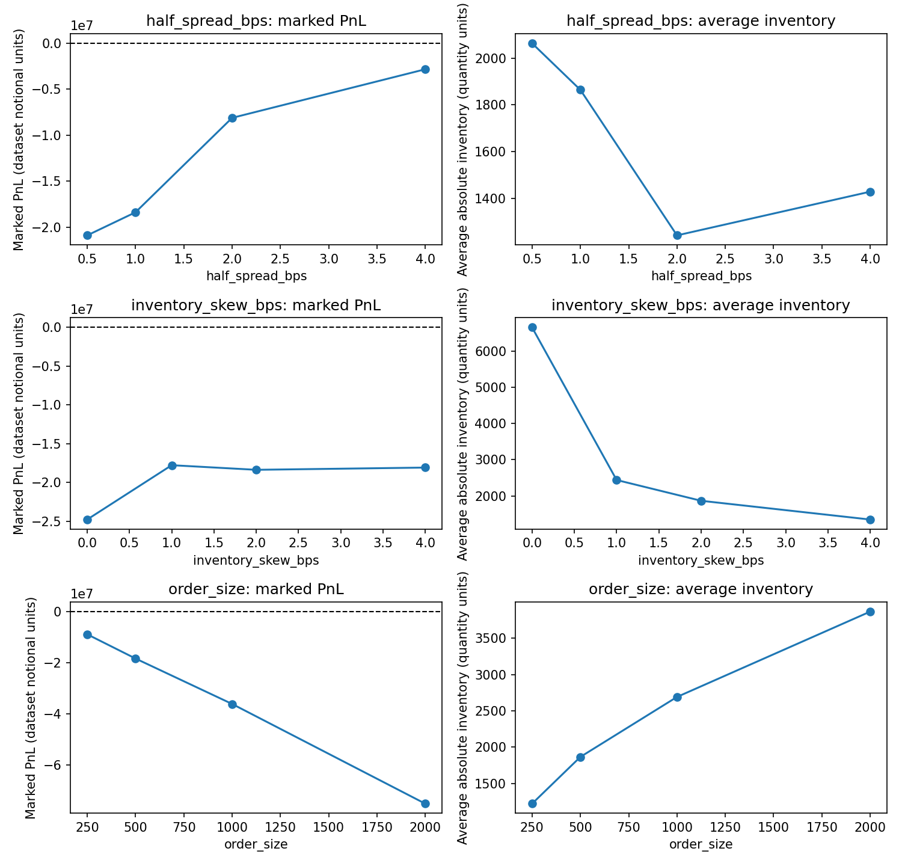

# Market Microstructure and Execution Analytics Research

## Project Overview

This independent learning project studies BTC limit-order-book (LOB) snapshots using spread, visible depth, and order-book imbalance (OBI) features. It evaluates weak short-horizon price-response signals and compares simplified visible-depth execution schedules through filled-quantity slippage, fill rate, and penalty-adjusted execution cost.

The repository is intended for methodology review and portfolio presentation. It is not a production execution algorithm, market-making system, HFT infrastructure, institutional transaction-cost model, or evidence of a live trading edge.

- Limit-order-book snapshot standardization and quality checks.
- Chronologically aligned feature construction using spread, depth, OBI, and lagged mid-price returns.
- Three-class short-horizon direction modelling with chronological train / validation / test splits.
- Visible-depth walking for simplified execution scheduling experiments.
- Joint evaluation of filled-quantity slippage, fill rate, unfilled quantity, and penalty assumptions.
- Robustness checks by forecast horizon, order size, and exploratory execution regime filters.
- A compact market-making mechanism extension using spread-based quotes, inventory skew, touch-based fills, and marked PnL accounting.

## Dataset Summary

| Item | Value |
|---|---|
| Asset | BTC |
| Market | Crypto |
| Data source | High Frequency Crypto Limit Order Book Data, Kaggle |
| Data type | Limit-order-book snapshots |
| Sample start date | 2021-04-07 11:32:42.122161+00:00 |
| Sample end date | 2021-04-19 09:53:52.386544+00:00 |
| Sampling frequency | Dataset filename indicates 1 second; observed 1-second gap ratio 0.999930 |
| Observations before cleaning | 1,030,728 raw rows in local source file |
| Observations after cleaning | 1,030,698 labelled rows |
| Visible book levels | Top 5 displayed levels used for features and visible-depth simulation |
| Forecast horizon | 30 seconds for headline prediction results |
| Target classes | Up: 395,120; Down: 384,588; Flat: 250,990 |
| Label threshold | Up if future mid-price return > 1 bp; Down if < -1 bp; otherwise Flat |
| Train period | 2021-04-07 11:32:42.122161+00:00 to 2021-04-15 19:59:40.182190+00:00 |
| Validation period | 2021-04-15 19:59:41.182190+00:00 to 2021-04-17 14:56:36.119741+00:00 |
| Test period | 2021-04-17 14:56:37.119741+00:00 to 2021-04-19 09:53:52.386544+00:00 |
| Quantity unit | dataset-provided quantity units |

## Headline Results

### Short-Horizon Direction Modelling

| Model | Accuracy | Balanced Accuracy | Macro F1 |
|---|---:|---:|---:|
| Rule-based OBI baseline | 0.4264 | 0.3713 | 0.3689 |
| Logistic Regression | 0.4634 | 0.3759 | 0.3633 |
| XGBoost | 0.4740 | 0.3774 | 0.3562 |

Logistic Regression improved test accuracy versus the rule-based OBI baseline but did not improve test macro F1. XGBoost had the highest raw accuracy but weaker macro F1 than both the OBI rule and Logistic Regression. The retained results indicate limited short-horizon predictive information rather than a strong directional or tradable signal.

Horizon robustness is mixed: Logistic Regression minus OBI-rule macro F1 is -0.0214 at 10 seconds, -0.0056 at 30 seconds, and +0.0041 at 60 seconds.

### Execution Simulation

Base execution comparison uses 20 rolling 30-minute windows, buy side, 30 decision slices, `target_qty = 500,000` dataset-provided quantity units, and top-5 visible-depth walking. The mean requested size is about 2.9532 times contemporaneous visible top-5 depth in these windows.

| Schedule | Requested Qty | Filled Qty | Fill Rate | Mean Slippage bps | Penalized Cost 0 bps | Penalized Cost 5 bps | Penalized Cost 20 bps |
|---|---:|---:|---:|---:|---:|---:|---:|
| Immediate depth walk | 500,000.00 | 87,794.92 | 17.56% | 0.0914 | 5,570.22 | 11,617,562.74 | 46,453,540.29 |
| Static TWAP | 500,000.00 | 342,488.33 | 68.50% | 0.8422 | -234,642.98 | 4,197,843.49 | 17,495,302.92 |
| Front-loaded | 500,000.00 | 329,378.45 | 65.88% | 0.9626 | 366,537.59 | 5,168,028.79 | 19,572,502.38 |
| Back-loaded | 500,000.00 | 324,034.05 | 64.81% | 0.7866 | -1,042,851.59 | 3,908,027.82 | 18,760,666.03 |
| Liquidity-weighted schedule / VWAP proxy | 500,000.00 | 373,205.66 | 74.64% | 1.5062 | 1,155,226.31 | 4,721,735.78 | 15,421,264.21 |
| Random fixed seed | 500,000.00 | 330,354.26 | 66.07% | 0.6653 | -235,181.09 | 4,539,414.43 | 18,863,201.00 |
| OBI-adjusted TWAP | 500,000.00 | 320,830.29 | 64.17% | 0.3111 | -2,613,413.72 | 2,427,494.72 | 17,550,220.05 |

Penalty-adjusted cost uses:

```text
execution_cost + unfilled_quantity * arrival_price * penalty_bps / 10000
```

The penalty is a sensitivity assumption, not calibrated opportunity cost or full implementation shortfall. Rankings are not stable across penalties: OBI-adjusted TWAP ranks first at 0 and 5 bps penalties, while the liquidity-weighted schedule / VWAP proxy ranks first at 20 bps because it fills more quantity. OBI-adjusted TWAP has lower filled-quantity slippage than TWAP in the base case, but it also completes less quantity.

### Regime Robustness

The regime filter is exploratory. With the default code path, spread and depth thresholds are expanding-window medians computed only from snapshots observed up to each decision point, combined with `|OBI| >= 0.2`.

| Regime | Windows / Configurations | Retained Share | Mean OBI-TWAP Slippage bps | OBI Beats TWAP Share |
|---|---:|---:|---:|---:|
| Unfiltered | 20 | 100.00% | +0.6088 | 30.00% |
| Filtered | 20 | 100.00% | +0.0420 | 50.00% |

The filter reduces the average OBI-minus-TWAP slippage gap, but the filtered result is close to zero and may reflect research selection. It requires independent chronological validation before being interpreted as a stable rule.

## Representative Figures

### OBI Decile vs Future Return



Train-sample OBI decile boundaries are applied to the test sample. The decile analysis is descriptive and should not be interpreted as a fully out-of-sample trading test.

### Model Metric Comparison



The model comparison highlights that raw accuracy and macro F1 can disagree. XGBoost has the highest test accuracy here but weaker macro F1 than the simple OBI rule.

### Slippage by Order Size



Order-size stress tests show that execution assumptions become material when requested size is large relative to displayed top-5 depth.

### Robustness by Regime Filter



Regime filtering reduces the average OBI-vs-TWAP slippage gap, but the filtered result is close to zero and should be treated as dataset-specific.

## Methodology

Features are based on information available at or before each timestamp: spread, relative spread, top-of-book imbalance, top-5 depth imbalance, displayed depth, and lagged mid-price returns. Future return is used only to construct the target label. The headline label uses a 30-second row shift, which is appropriate only because the observed sampling is close to regular 1-second snapshots.

Model controls:

- Train / validation / test partitions are chronological 70% / 15% / 15% splits.
- Logistic Regression uses train-fitted median imputation and scaling inside a pipeline.
- XGBoost uses train-fitted median imputation; validation data is passed as an evaluation set, while the reported headline metrics are from the untouched test split.
- The test set is not used for model fitting or threshold selection in the retained public workflow.
- OBI decile boundaries for the displayed figure are estimated on the train sample and applied to the test sample.
- The label threshold is fixed at +/-1 bp for headline 30-second results.

Execution controls:

1. Observe the current top-of-book and visible top-5 depth.
2. Calculate current spread, OBI, and liquidity state.
3. Determine the next child-order size from current and trailing information.
4. Walk the contemporaneous visible book.
5. Record fill, filled-quantity slippage, cost, and remaining quantity.
6. Advance to the next timestamp.

The VWAP-labelled schedule is a liquidity-weighted execution proxy based on displayed order-book conditions. It is not a reconstruction of market VWAP from actual traded-volume profiles.

## Simplified Market-Making Extension

The fifth notebook is an optional research extension: a simplified inventory-aware market-making simulation under visible-order-book assumptions. It compares a symmetric quoting baseline with an inventory-aware quoting rule on the same fixed snapshot window. Fills use a deterministic one-next-snapshot touch proxy, and P&L is marked in dataset-provided notional units.

| Metric | Symmetric | Inventory-aware |
|---|---:|---:|
| Total marked PnL | -24,793,739.01 | -18,375,265.54 |
| Fill rate | 21.64% | 21.49% |
| Trades | 2,095 | 2,149 |
| Average absolute inventory | 6,660.10 | 1,864.30 |
| Maximum absolute inventory | 12,500.00 | 6,500.00 |
| Gross spread-capture proxy | 5,992,820.40 | 5,977,278.53 |
| Inventory revaluation PnL | -27,831,170.00 | -21,321,217.50 |
| Fees | 2,955,389.41 | 3,031,326.56 |

In this retained fixed sample, inventory-aware quoting reduces average and maximum inventory exposure while leaving fill rate close to the symmetric baseline. Both simulations produce negative marked PnL, so the result should be read as an inventory-risk mechanism study rather than evidence of positive live trading performance.





## Assumptions and Limitations

Data limitations:

- Crypto snapshots do not represent equities or institutional execution conditions.
- The dataset uses snapshots rather than message-level order event data.
- The public analysis uses top-5 visible depth.
- Quantity units are dataset-provided quantity units and are not confirmed as BTC.
- There are no trade prints or actual market-volume curves for true VWAP reconstruction.

Prediction limitations:

- Incremental balanced-metric performance is weak.
- The three-class target has class imbalance.
- Prediction horizons overlap, creating serial dependence.
- The test period is limited to the final chronological segment of this dataset.

Execution limitations:

- No queue position, order priority, latency, cancel/replace logic, hidden liquidity, depth replenishment, calibrated market impact, venue fragmentation, or adverse-selection model is included.
- Fees are not modelled in the execution schedule comparison.
- Penalized execution cost is an assumption-driven sensitivity metric.
- OBI-adjusted scheduling is not claimed to be optimal or consistently superior.

## Repository Structure

```text
market_microstructure_learning/
|-- README.md
|-- requirements.txt
|-- data/
|   `-- README.md
|-- notebooks/
|   |-- 01_data_overview.ipynb
|   |-- 02_prediction.ipynb
|   |-- 03_execution.ipynb
|   |-- 04_robustness.ipynb
|   |-- 05_market_making_simulation.ipynb
|   `-- README.md
|-- reports/
|   |-- final_report.md
|   |-- figures/
|   `-- selected_tables/
|-- src/
|   |-- data_loader.py
|   |-- features.py
|   |-- labels.py
|   |-- models.py
|   |-- execution.py
|   |-- execution_analysis.py
|   |-- signal_execution.py
|   |-- market_making.py
|   `-- market_making_plots.py
`-- tests/
```
